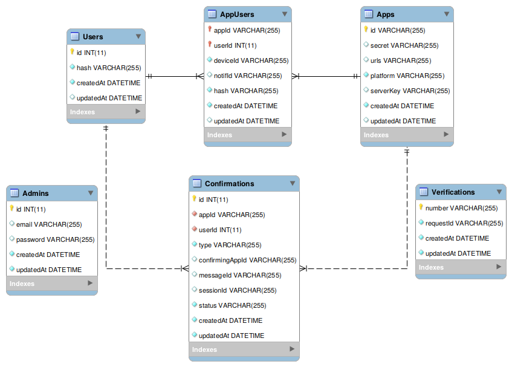

# HumanID API Server + Web SDK

[](https://travis-ci.org/bluenumberfoundation/humanid-api)

HumanID API server. API doc and demo https://humanid.herokuapp.com

Details about HumanID Web SDK can be found [here](client/README.md)

Demo data:

**Admin**

```JSON
{
    "email": "admin@local.host",
    "password": "admin123"
}
```

**Apps**

```JSON
[{
    "id": "DEMO_APP",
    "secret": "2ee4300fd136ed6796a6a507de7c1f49aecd4a11663352fe54e54403c32bd6a0",
    "platform": "ANDROID",
	"serverKey": "AAAA....S4"    
},
{
    "id": "DEMO_APP_IOS",
    "secret": "541ec90bf636f0a8847885af37faedc258dcc875481f870d507c64d0e785bc1e",
    "platform": "IOS",
	"serverKey": null
}]
```

**Users**

```JSON
{
    "countryCode": "62",
    "phone": "81234567890",
    "hash": [
        "7a009b9c3203ac3ff081146137e658583d2d60cf867acdb49716b84f1603f8a4", // For DEMO_APP
        "0c88468123e1c193a5f2e925d360266025f739f30ed0eeab7321887905f8c68c", // For DEMO_APP_IOS
    ]
}
```

## Prerequisites

1. Node.js >= 10 LTS
2. RDBMS (MySQL >= 14.14 or SQLite3 >= 3.22)

## Setup

1. Install `nodejs >= 10.x.x`
2. Clone repo & install dependencies `npm i`
3. Run test `npm test`
4. Generate database (drop & create) by running `npm run db:refresh` on Linux/MacOS
5. Generate doc `npm run doc` (requires `apidoc` http://apidocjs.com/)
6. Build client SDK (javascript) `npm run build`
   
> To generate database on Windows **maybe** you can run `setx NODE_ENV=DATABASE && npx sequelize db:drop && sequelize db:create && npx sequelize db:migrate && npx sequelize db:seed:all` **(UNTESTED)**

## Configuration

App configuration is read from `config.json`. You can reuse the provided example in `config.json.example`. 

**Database**

For `DATABASE` configuration please refer to [Sequelize configuration](http://docs.sequelizejs.com/manual/getting-started). Some common examples:

> Sqlite3 file storage

```JSON
{
    ...
    "DATABASE": {
        "username": "root",
        "password": null,
        "database": "humanid",
        "dialect": "sqlite",
        "storage": "db.sqlite"
    },
    ...
}
```

> MySQL with connection pooling

```JSON
{
    ...
    "DATABASE": {
        "username": "root",
        "password": "root",
        "database": "humanid",
        "dialect": "mysql",
        "pool": {
            "max": 5,
            "min": 0,
            "acquire": 30000,
            "idle": 10000
        }    
    },
    ...
}
```

**SMS OTP/Verification**

To enable phone number verification SMS using [Nexmo](https://www.nexmo.com/products/sms) please provide valid configuration like below (replace values with your own account details):

```JSON
{
    "NEXMO_REST_URL": "https://rest.nexmo.com",
    "NEXMO_API_KEY": "abcd1234",
    "NEXMO_API_KEY": "abcdefgh12345678",
}
```
> If one or more value are missing, no verification SMS will be triggered and verification code is not validated (**always considered valid**)

**Push Notification**

To enable push notification using [Firebase Cloud Messaging](https://firebase.google.com/docs/admin/setup?authuser=0#initialize_the_sdk), provide valid like below (replace values with your own account details):

```JSON
{
    "FIREBASE_SERVER_KEY": "AAAAVo...BmFpE",
}
```

> Currently this is only used for IOS. For Android, `serverKey` for each apps are used

## Class/Entity Relationship Diagram

The API server stores data in given structure:

> `SequelizeMeta` is just ORM migration metadata which is not related to business process




## Web Login Examples

Web login implementation example can be found in `http://localhost:3000/examples/login.html` (publishing from `examples/` dir). 

To simulate web login with push notification, follow these steps:

0. Make sure Push Notification configuration above has been done
1. Open in a tab `http://localhost:3000/examples/confirm.html` and **allow** notification. Leave it open
2. Open in **another** tab `http://localhost:3000/examples/login.html` enter country code & phone number (demo data provided above) and click **Login by App**
3. Go to previous tab that points to `http://localhost:3000/examples/confirm.html`. A confirmation dialog should be shown. Click **Confirm**
4. Return to tab `http://localhost:3000/examples/login.html`. In less than 5 seconds, you should be redirected to `http://localhost:3000/examples/secured.html`

> In the actual implementation, every actions in `confirm.html` **can only be done** from mobile device. Because it requires login hash which should be kept secret per user/app.

To simulate web login with OTP SMS, follow these steps:

0. Make sure SMS OTP/Verification above has been done, and you have register a valid phone number using [POST /mobile/users/register](https://humanid.herokuapp.com/#api-Mobile-RegisterUser)
1. Open `http://localhost:3000/examples/login.html` enter country code & phone number (demo data provided above) and click **Login by SMS**
2. Wait for SMS containing OTP, enter it to the form, then click **Verify & Login**
3. You should be redirected to `http://localhost:3000/examples/secured.html`

## Mobile API Recipes

**Registration**

Fresh login (no other partner app logged-in yet):

1. [POST /mobile/users/verifyPhone](https://humanid.herokuapp.com/#api-Mobile-VerifyPhone) Verify user phone number (request OTP SMS) 
2. [POST /mobile/users/register](https://humanid.herokuapp.com/#api-Mobile-RegisterUser) Register user. Get the `hash` from response and store safely in device

**Login**

Login when there is another existing partner app logged-in:

1. [POST /mobile/users/login](https://humanid.herokuapp.com/#api-Mobile-LoginUser) Login using existing partner app `hash`. Get the `hash` for the new app and store it safely
   
**Validation**

Check if a `hash` is still valid:

1. [GET /mobile/users/login](https://humanid.herokuapp.com/#api-Mobile-LoginUserCheck) Get login status

**Switch Device** 

Login from a new device (previously logged-in from different device):

> The same as new registration. Everything else is handled in server/backend

1. [POST /mobile/users/verifyPhone](https://humanid.herokuapp.com/#api-Mobile-VerifyPhone) Verify user phone number (request OTP SMS) 
2. [POST /mobile/users/register](https://humanid.herokuapp.com/#api-Mobile-RegisterUser) Register user. Get the `hash` from response and store safely in device 

**Update phone**

Update phone number from an logged-in app:

1. [POST /mobile/users/verifyPhone](https://humanid.herokuapp.com/#api-Mobile-VerifyPhone) Verify user **new** phone number (request OTP SMS) 
2. [POST /mobile/users/updatePhone](https://humanid.herokuapp.com/#api-Mobile-UpdatePhone) Update phone 

**Web login confirmation**

Confirm login request from web client:

1. [PUT /mobile/users](https://humanid.herokuapp.com/#api-Mobile-Update) Update notification ID (get it from Firebase Cloud Messaging SDK) 
2. [POST /web/users/confirm](https://humanid.herokuapp.com/#api-Mobile-Confirm) Confirm (after receiving push notification)
3. [POST /web/users/reject](https://humanid.herokuapp.com/#api-Mobile-Reject) Or reject 

Push notification payload that need to be handled:

```JSON
{
    "type": "WEB_LOGIN_REQUEST", 
    "requestingAppId": "APP_ID"
}
```